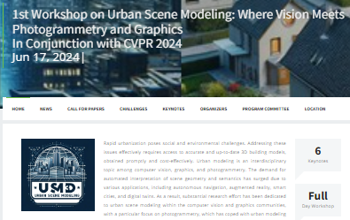
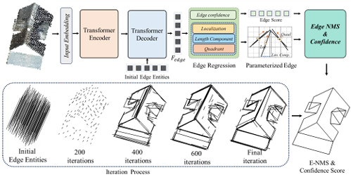
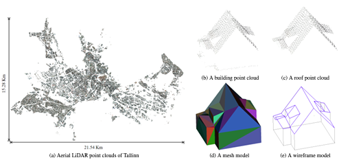

# 📝 Publications

CVPR 2024 Workshop

[Urban Scene Modeling: Where Vision Meets Photogrammetry and Graphics
In Conjunction](https://usm3d.github.io/) \\
One of the organizers.

[**Project**](https://usm3d.github.io/) <strong></strong>

- 1st Workshop on Urban Scene Modeling: Where Vision Meets Photogrammetry and Graphics In Conjunction with CVPR 2024

CVPR 2024

[PBWR:Parametric Building Wireframe Reconstruction from Aerial LiDAR Point Clouds](https://arxiv.org/pdf/2307.11914) \\
**Shangfeng Huang**, Ruisheng Wang, Bo Guo,Hongxin Yang

[**Project**](#) <strong></strong>

- It directly regresses desired edges without any intermediate heuristic-guided process.

ICCV 2023

[Building3D: An Urban-Scale Dataset and Benchmarks for Learning Roof Structures from Point Clouds](https://arxiv.org/pdf/2307.11914) \\
Ruisheng Wang, **Shangfeng Huang**, Hongxin Yang

[**Project**](https://building3d.ucalgary.ca/) <strong></strong>

- The **first and largest** urban-scale building modeling dataset.
- The dataset consists of **aerial LiDAR point clouds, mesh and wireframe models**.

- [SSA3D: Semantic segmentation assisted one-stage three-dimensional vehicle object detection](https://ieeexplore.ieee.org/document/9652096), **Shangfeng Huang**, Guorong Cai, Zongyue Wang, Qiming Xia, Ruisheng Wang, **TITS**
- [Detail](https://scholar.google.ca/citations?hl=en&user=iCsHFo4AAAAJ)
